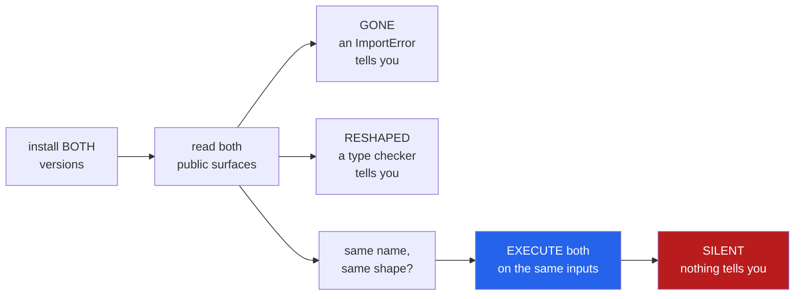

<h1 align="center">blast-radius (Python · inspect · differential testing · AST)</h1>
<p align="center"><i>What a dependency upgrade actually changes — including what nothing warns you about</i></p>

<p align="center">
  <a href="#the-through-line">The through-line</a> &middot;
  <a href="#the-result">The result</a> &middot;
  <a href="https://github.com/hammasbuilds/blast-radius/blob/main/docs/SEMVER.md">The semver sweep</a> &middot;
  <a href="https://github.com/hammasbuilds/blast-radius/blob/main/docs/RESULTS.md">Full results</a> &middot;
  <a href="#how-it-works">How it works</a> &middot;
  <a href="#run-it">Run it</a> &middot;
  <a href="#what-this-does-not-do">What it does NOT do</a> &middot;
  <a href="#problems-hit-while-building-this">Problems hit</a>
</p>

<p align="center">
  <a href="https://github.com/hammasbuilds/blast-radius/actions/workflows/ci.yml"></a>
  
  
  
  
  
  <a href="https://github.com/hammasbuilds/blast-radius/blob/main/LICENSE"></a>
</p>

---

## The through-line



A dependency bump arrives as a version number and a changelog. Neither is evidence. This
sorts what actually changed by **how likely it is to reach production unnoticed**:

| | who tells you |
|---|---|
| a name that vanished | an `ImportError`, at startup, on any CI run |
| a signature that changed | a type checker, if you run one against a typed dependency |
| **same name, same signature, different answer** | **nothing** |

> **A changelog is a claim. This is the diff.**

## The result

### 27 upgrade pairs: how often does a patch release break public API?

Semantic versioning says a patch release changes nothing a caller can see, and a minor
release only adds. Measured across widely-pinned packages:

| Bump | Pairs | Broke exported API | Exported symbols removed or reshaped |
|---|---:|---:|---:|
| **patch** | 15 | **2 (13%)** | 3 |
| **minor** | 9 | **4 (44%)** | 16 |
| major | 3 | 2 (67%) | 47 |

Small enough to name every instance, which is the point — a percentage with no names behind
it is not checkable.

**`urllib3` 2.2.1 → 2.2.2**, a patch release, added a **required** keyword-only parameter to
`BaseHTTPResponse.__init__`, inserted between `version` and `reason`:

```
2.2.1  (*, headers=None, status, version,                 reason, decode_content, ...)
2.2.2  (*, headers=None, status, version, version_string, reason, decode_content, ...)
```

Every subclass calling `super().__init__(...)` now raises `TypeError`. `HTTPResponse` takes
the same parameter positionally, so positional callers have `reason` land silently in
`version_string`.

The first version of this sweep said **38%**. Three bugs in the probe were inflating it —
aliased symbols counted once per importing module, internal module moves read as removals,
and internal churn weighed the same as published API. Every correction moved the number
down.

&#128202; **[The full sweep, every break named, and the three corrections &rarr;](https://github.com/hammasbuilds/blast-radius/blob/main/docs/SEMVER.md)**

### One upgrade in depth

`packaging` 21.3 → 24.0, with call sites matched against [`pypa/build`](https://github.com/pypa/build):

```
gone         12   an ImportError at startup
reshaped      5   a type checker would catch these
SILENT        2   nothing catches these
added        10
```

The one worth the whole tool:

```
packaging.version.parse
  same signature (version: str)
  input : ("",)
   21.3 : ok: <LegacyVersion('')>
   24.0 : raise: InvalidVersion: Invalid version: ''
```

`parse("")` returned a value and now raises. Same name, same signature. No import fails and
no type checker complains — it takes running both versions to find.

And **8 of the changes are referenced by `pypa/build`'s own source**, with file and line:

```
[gone    ] packaging.specifiers.LegacySpecifier.contains   src/build/_util.py:66
[reshaped] packaging.utils.canonicalize_name               src/build/env.py:241
```

An upgrade removing forty functions nobody calls is a non-event. The same upgrade touching
one you call in a loop is an incident — so the report sorts by that before anything else.

### And an honest failure

`click` 7.1.2 → 8.1.7: **0 functions exercised, 400 unreachable.**

`packaging` is largely pure functions over strings, so generated values reach them. `click`
is classes and decorators that need a constructed `Context` first, and a tool that calls
functions with literals cannot get there. The report says *"could not be called"* rather
than *"no changes found"*, because those are different claims.

See [docs/RESULTS.md](https://github.com/hammasbuilds/blast-radius/blob/main/docs/RESULTS.md) for both runs.

## How it works

**Both versions, side by side, in separate processes.** Two versions of one package cannot
coexist in an interpreter — `sys.modules` is keyed by name, so the second import wins and
every later comparison is one version against itself. Each is probed in its own subprocess,
and **the probe proves which file it loaded** before reporting anything.

**Only the package's own names.** `dir(module)` returns everything reachable, third-party
imports included. Symbols are filtered by `__module__`.

**Call shape, not signature text.** Two signatures are "the same" when their parameter
names, kinds and defaults match. Annotations are excluded on purpose: adding a type hint
cannot break a caller.

**Then execute what survived unchanged.** Only functions that kept both name and call shape
are run, on the same generated inputs, in both versions. Comparing behaviour across a
signature change would find differences the signature already explained.

## Run it

```bash
git clone https://github.com/hammasbuilds/blast-radius
cd blast-radius
uv venv && uv pip install -e ".[dev]"

blast-radius check packaging 21.3 24.0
blast-radius check packaging 21.3 24.0 --used-by /path/to/your/repo
blast-radius check requests 2.28.0 2.31.0 --no-behaviour   # API diff only, fast

# in CI, on a dependency bump PR
blast-radius check some-lib 1.2.0 1.3.0 --used-by . --fail-on-silent
```

Needs no model, no API key, no GPU. It installs both versions itself, with `uv` if present
and `pip` otherwise, into throwaway directories it cleans up.

## Layout

```
src/blast_radius/
  probe.py    import one version in a subprocess; PROVE which file it loaded
  diff.py     gone / reshaped / added, then execute what survived unchanged
  report.py   sorted by what can reach you, silent changes first
  types.py    the three kinds, and why they are ordered that way
```

## What this does NOT do

- **It does not read changelogs.** Deliberately. The changelog is the claim being checked.
- **It cannot reach every API.** Functions needing a constructed object are unreachable and
  reported as such — on `click`, that was all of them.
- **Generated arguments, not real ones.** A small pool of literals, varied one parameter at
  a time. A behaviour change that only shows on a complex input will be missed.
- **Public surface only.** A project reaching into private names is not covered.
- **Call-site matching over-reports.** It matches trailing names, so a project with its own
  `parse` is credited with using `packaging.version.parse`. That is the right direction to
  err: a missed call site is a break that reaches production, a spurious one costs ten
  seconds.

## Problems hit while building this

Seven sources of *confident wrong answers*. Not one of them raised an error.

- **Both probes loaded the same copy, and it reported "nothing changed".** Python silently
  ignores a `sys.path` entry that does not exist, so a non-native path meant the import fell
  through to the interpreter's own `packaging`. Two probes of one copy agree perfectly,
  which looks exactly like a clean upgrade. The probe now proves its own `__file__`.
- **Object identity read as behaviour.** `packaging.tags.Tag.__repr__` embeds `id(self)` in
  **decimal**, and the normaliser only stripped hex `0x...` forms — so four identical tag
  lists came back as four silent behaviour changes.
- **455 removed symbols that were never there.** `packaging` 21.3 does
  `from pyparsing import ...`, so a naive walk credited it with pyparsing's entire API, and
  dropping that dependency read as a mass extinction.
- **795 breaking changes that break nothing.** click 8 annotated its whole API. Comparing
  `str(inspect.signature(f))` called every one of those a reshape — and left **zero**
  functions stable, which silently starved the behaviour pass of every candidate it had.
  Comparing call shape took it to 68 and turned the pass back on.
- **One object counted once per module that imported it.** `coverage.CoverageData` is
  imported into five modules, so a single signature change to `update` was reported as six
  reshaped symbols. `coverage` 7.5.0's surface was 1,409 symbols; deduplicated it is
  **547** — inflated 2.6x by aliases. This is also why moving a class between internal
  modules read as a removal plus an addition, although `from coverage import PathAliases`
  still worked and no caller could tell.
- **Internal churn weighed the same as published API.** `coverage.parser.join_regex`
  counted exactly as much as `coverage.CoverageData.update`, so a release that tidied its
  internals looked like one that broke its users. Symbols now carry an `exported` flag,
  set when the author said so via `__all__` or the package root namespace.
- **A failed install crashed the whole run, on Windows only.** `subprocess.run(text=True)`
  decodes with the locale codec — cp1252 here — and `uv` draws its errors with box
  characters that cp1252 cannot represent. The resulting `UnicodeDecodeError` came from
  subprocess's reader thread, is not an `OSError`, and was not caught, so the fallback to
  pip never happened. Fixed by decoding UTF-8 explicitly; `install()` now also reports
  **why** it failed instead of returning a bare `False`.

## Also worth reading

| | |
|---|---|
| &#128200; **[The semver sweep](https://github.com/hammasbuilds/blast-radius/blob/main/docs/SEMVER.md)** | 27 upgrade pairs, every break named |
| &#128202; **[Results](https://github.com/hammasbuilds/blast-radius/blob/main/docs/RESULTS.md)** | Both upgrades in full, with the limits |
| **[suite-auditor](https://github.com/hammasbuilds/suite-auditor)** | The same differential idea, pointed at a test suite |
| **[pr-referee](https://github.com/hammasbuilds/pr-referee)** | And pointed at a diff |
| **[repo-surgeon](https://github.com/hammasbuilds/repo-surgeon)** | And at a migration, refusing what it cannot prove |

## Keywords

dependency upgrade &middot; breaking change &middot; semantic versioning &middot; API diff
&middot; differential testing &middot; regression detection &middot; supply chain &middot;
dependabot &middot; CI &middot; python packaging &middot; inspect &middot; AST &middot;
call site analysis

## License

MIT - see [LICENSE](https://github.com/hammasbuilds/blast-radius/blob/main/LICENSE).
